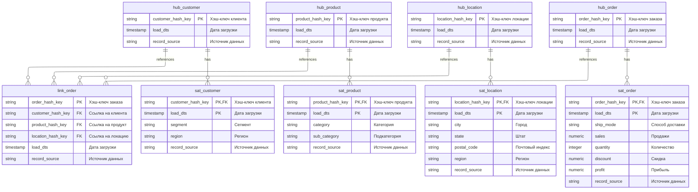

```mermaid
---
config:
  layout: elk
---
erDiagram
    hub_customer {
        string customer_hash_key PK "Хэш-ключ клиента"
        timestamp load_dts "Дата загрузки"
        string record_source "Источник данных"
    }
    hub_product {
        string product_hash_key PK "Хэш-ключ продукта"
        timestamp load_dts "Дата загрузки"
        string record_source "Источник данных"
    }
    hub_location {
        string location_hash_key PK "Хэш-ключ локации"
        timestamp load_dts "Дата загрузки"
        string record_source "Источник данных"
    }
    hub_order {
        string order_hash_key PK "Хэш-ключ заказа"
        timestamp load_dts "Дата загрузки"
        string record_source "Источник данных"
    }
    link_order {
        string order_hash_key PK "Хэш-ключ заказа"
        string customer_hash_key FK "Ссылка на клиента"
        string product_hash_key FK "Ссылка на продукт"
        string location_hash_key FK "Ссылка на локацию"
        timestamp load_dts "Дата загрузки"
        string record_source "Источник данных"
    }
    sat_customer {
        string customer_hash_key PK,FK "Хэш-ключ клиента"
        timestamp load_dts PK "Дата загрузки"
        string segment "Сегмент"
        string region "Регион"
        string record_source "Источник данных"
    }
    sat_product {
        string product_hash_key PK,FK "Хэш-ключ продукта"
        timestamp load_dts PK "Дата загрузки"
        string category "Категория"
        string sub_category "Подкатегория"
        string record_source "Источник данных"
    }
    sat_location {
        string location_hash_key PK,FK "Хэш-ключ локации"
        timestamp load_dts PK "Дата загрузки"
        string city "Город"
        string state "Штат"
        string postal_code "Почтовый индекс"
        string region "Регион"
        string record_source "Источник данных"
    }
    sat_order {
        string order_hash_key PK,FK "Хэш-ключ заказа"
        timestamp load_dts PK "Дата загрузки"
        string ship_mode "Способ доставки"
        numeric sales "Продажи"
        integer quantity "Количество"
        numeric discount "Скидка"
        numeric profit "Прибыль"
        string record_source "Источник данных"
    }
    hub_customer ||--o{ sat_customer : has
    hub_product ||--o{ sat_product : has
    hub_location ||--o{ sat_location : has
    hub_order ||--o{ sat_order : has
    hub_customer ||--o{ link_order : references
    hub_product ||--o{ link_order : references
    hub_location ||--o{ link_order : references
    hub_order ||--o{ link_order : references
```